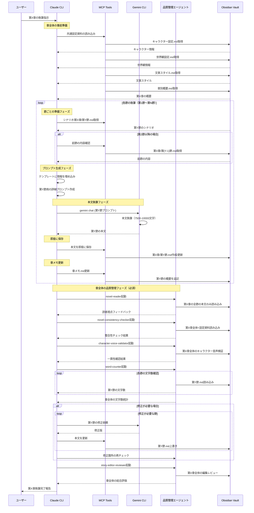

## ディレクトリ構造
```
/vaults/
└─/novel-archive/
  ├── /作品名_1/
  │   ├── /設定資料/
  │   │   ├── キャラクター設定.md
  │   │   ├── 世界観設定.md
  │   │   ├── タイムライン.md
  │   │   └── 用語集.md
  │   ├── /プロット/
  │   │   ├── 全体構成.md
  │   │   └── 章別概要.md
  │   ├── /本文/
  │   │   ├── /第1章/
  │   │   │   ├── 第1節.md
  │   │   │   ├── 第2節.md
  │   │   │   ├── 第3節.md
  │   │   │   └── 章メモ.md
  │   │   ├── /第2章/
  │   │   │   ├── 第1節.md
  │   │   │   ├── 第2節.md
  │   │   │   ├── 第3節.md
  │   │   │   └── 章メモ.md
  │   │   ├── サンプル.txt
  │   │   └── ...
  │   ├── /シナリオ/
  │   │   ├── /第1章/
  │   │   │   ├── 第1節.md
  │   │   │   ├── 第2節.md
  │   │   │   ├── 第3節.md
  │   │   │   └── 章メモ.md
  │   │   ├── /第2章/
  │   │   │   ├── 第1節.md
  │   │   │   ├── 第2節.md
  │   │   │   ├── 第3節.md
  │   │   │   └── 章メモ.md
  │   │   └── ...
  │   ├── 編集レビュー.md
  │   └── /メモ/
  │       ├── 編集レビュー.md
  │       ├── ブレインストーミング.md
  │       ├── 文章スタイル.md
  │       └── ...
  ├── /作品名_2/
  │   └── （同様の構造）
  └── /共通資料/
      └── 執筆ガイドライン.md
```

## 本文執筆フロー



## 注意事項

### 執筆プロセス管理
- 各章・節の執筆時は、必ず前の節までの内容を確認する
- **執筆前に`メモ`ディレクトリを参照してください**
- 作品設定を逐次参照してください
- 特に指定がない場合は、三人称神視点で執筆してください

### 執筆ルール
- **本文の執筆には、かならずgemini-cliを使用してください**
  - 使用モデル：Gemini 2.5 Pro
  - 一つの節につき一回呼び出してください。
  - gemini-cliが執筆の際に困難を感じないように、最大限詳細に以下のテンプレートに従ってプロンプトを渡してください
  - 必要に応じてシステムプロンプトも渡してください

#### 本文執筆用プロンプトテンプレート
以下のテンプレートに、作品固有の情報を埋め込んでそのままgemini-cliに渡してください：

```markdown
### 【目的】
- 以下に渡される除法を基に、ライトノベル形式の小説原稿を生成してください。
- 「最高に面白い」作品を目指すため、設定・ストーリー展開に矛盾や破綻がないように注意しつつ、多彩な描写・魅力的なキャラクター表現を追求してください。

### 【執筆にあたっての基本方針】
1. **情報参照**
   - 以下に渡される「各章のアウトライン」「世界観」「登場人物」を参照し、それらを最大限活用してください。
   - ストーリー上の整合性・キャラクター設定の整合性・世界観との整合性を常に意識し、矛盾がないようにしてください。

2. **作品ジャンルに準拠**
   - 作品ジャンルをよく理解し、該当ジャンルの特色を活かした文章・展開を心がけてください。

3. **章タイトル**
   - 章のタイトルを示す際には、必ずその章の文字数（指定された文字数）も併記してください。

4. **ライトノベルの体裁**
   - 想定は「印刷所にそのまま入稿できるクオリティの小説原稿」です。
   - Markdownの見出しや区切り線を活用して章やチャプターを示してください。
   - ただし、強調（太字・斜体など）や過度な装飾は使用しないでください。
   - 文体は「三人称神視点」で統一してください。主人公に限らず、必要に応じて視点を切り替えながら物語を展開して構いません。
   - 各章の最後に特別な語り口（メタ的な締め台詞など）は不要です。

5. **情報開示の順序**
   - 本文内で設定や伏線を「一度に大量に説明」しないでください。読者の好奇心を刺激するため、必要に応じて少しずつ小出しにしながら明らかにしてください。
   - 序盤の地の文で「まだキャラクターや読者が知り得ない情報や伏線」をすべて開示しないように注意してください。
   - 情景描写や風景描写を多めに用い、感情描写は状況描写から自然に読み取れる表現を意識してください。
   - 本文を書く際は、`Show, don't tell.`の原則を遵守
     - 設定情報は地の文で直接説明せず、会話・行動・描写・内的独白を通じて自然に読者に伝える
     - キャラクターの過去や性格、世界観の詳細は、日常の会話や反射的な行動、環境への反応などで暗示する

6. **登場人物の描写**
   - 以下に「各キャラクターに設定された口調・人称・性格・台詞例」が示されています。その台詞例はあくまで"参考"です。同じセリフをそのまま使わず、あくまでキャラクター像を理解するために利用してください。
   - 心情を直接的に書きすぎず、登場人物の行動や情景描写を通じて読者に推測させるような書き方を心がけてください。
   - キャラクター同士の関係性や性格設定に矛盾が生じないよう、細心の注意を払ってください。

7. **人称・呼称・ルビ振り**
   - 以下に示された「各キャラクターが使用する一人称・二人称・三人称」を都度確認して厳守してください。
   - 地の文でキャラクターを呼ぶ場合、日本名なら漢字表記、外国名ならカタカナ表記に統一してください。姓名ではなく、基本的には「名前か愛称」表記を用いてください。
   - 特殊な読み方をする語には、次の形式でルビを振ってください：
     例）｜完全市民権《フルパッケージ》
     例）｜本気《マジ》
     （｜（縦線）はルビを振る文字の始点、《》内にルビを記載）
   - 心の中のモノローグは丸括弧「（ ）」を使ってください。
   - テレパシーや文字ベースのチャット・通信・電話など、口に出さない会話は二重カギ括弧「『 』」を使ってください。

8. **ストーリー整合性**
   - キャラクターの知性・性格・能力などを踏まえ、不自然な行動や言動を取らせないようにしてください。
   - 残虐なキャラクターが圧倒されたり、緻密なキャラクターが失敗したりする場面はあってもよいですが、説得力ある理由づけが必要です。
   - 「IQ180の天才が単純なミスをする」「極度に暴力的なキャラが急に人情に厚い言動をとる」など、キャラクター崩壊は避けてください。
   - アウトラインに示された展開を参照しつつ、全体としてストーリーが破綻していないか検証しながら執筆してください。

### 登場キャラクター
[執筆する節に登場するキャラクターの情報を設定資料ディレクトリ内のファイルからそのまま抜粋]

### 使用する世界観
[執筆する節に登場する世界観の情報を設定資料ディレクトリ内のファイルからそのまま抜粋]

### シナリオ
[執筆する節のシナリオを、シナリオディレクトリからそのまま抜粋]

### 文章のスタイル
[文章スタイル.mdの内容をそのまま抜粋]

### 【最終的な出力形式】
以下の構成で各章を出力してください。
1. 章タイトル（例：「### 第○章 ○○」）
2. 章の文字数（指定された文字数を明示）
3. アウトライン（その章の骨子・シーン配分などを簡潔に）
4. 原稿（ライトノベル本文）

上記のルール・構成を踏まえた上で、小説の本文を作成してください。
```

### 品質管理エージェント（必須プロセス）
- **本文・シナリオを執筆語は1章ごとには必ず以下のエージェントを使用する：**
  1. **novel-readerエージェント**：読者視点でのフィードバック取得
     - 本文（第X節.mdファイル）のみにアクセス
     - プロット、設定資料、章メモ等にはアクセスしない
  2. **novel-consistency-checkerエージェント**：設定資料との整合性チェック
  3. **character-voice-validatorエージェント**：キャラクター音声の一貫性検証
  4. **word-counterエージェント**：文字数確認（目標に不足する場合は書き足し）

### 物語構成時のルール
- 原則、シナリオ及び本文には、キャラクター設定.mdに載っている人物のみを登場させる
  - 不足する場合はキャラクター設定.mdにキャラクターを追加

### 文章スタイル管理
- 文章のスタイルに関する言及や指示があった場合は、文章スタイル.mdにメモする
- サンプル.txtがある場合：
  - キャラクター性/文体/描写の分析に役立てる
  - 本文執筆の際には文体や台詞回しをサンプル.txtを尊重する
  - 文章スタイル.mdが空または不適合な場合、以下のルールで作成：
    - 文体/描写/台詞の3要素で構成
    - 個人のキャラクターや場面に依存しない全体的なテイストを分析

### ドキュメント形式
- 章別概要.mdと全体構成.mdは箇条書きを使用せず文章形式で詳細に解説
- 編集レビュー.md作成時は、既存ファイルがある場合は上書きする
- 関係図などの図表は適切な種類のMermaidダイアグラムとして書く

### システム管理
- 作品ごとに独立したディレクトリで管理し、設定の混在を防ぐ
- キャラクターの一貫性維持のため、各作品の設定ファイルは常に最新に保つ
- 既存のコンテンツを改善した場合は、改善前のバージョンを上書きする
  - ファイル編集時は、time MCPサーバーで現在時刻を取得し、ファイル冒頭に最終編集時を追加
- 実行結果はファイルとして残さず、必要に応じて作成した場合は実行の最後に削除

## ルビの挿入
ルビを振る文字の始点に「｜」（縦線）、終点に「《》」（二重山括弧）を入力し、ルビを「《》」（二重山括弧）内に入力してください。
入力例：わたしは｜山田太郎《やまだたろう》と申します。
｜（縦線）はルビを振る文字の始点を表す記号で、《》で囲まれた文字がルビとなります。
｜（縦線）は全角記号を使用してください。

# 追加の指示
@CLAUDE.local.md