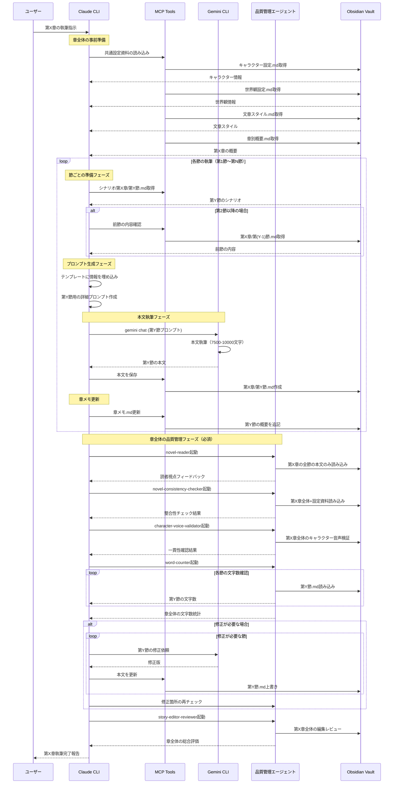

このCLAUDE.mdファイルは、Docker環境で動作するClaude CLIコンテナのための設定ファイルです。Claude CLIがmcp-obsidianサービスを介してObsidian Vaultにアクセスし、日本語小説執筆を支援するための指示が含まれています。

## プロジェクト概要
このプロジェクトは、Docker環境でClaude CLIとObsidianを連携させた日本語小説執筆システムです。Claude CLIコンテナからmcp-obsidianサービスを経由してObsidian Vaultの共有ボリュームにアクセスし、複数の作品を効率的に管理・執筆できる環境を提供します。各作品は独立したディレクトリで管理され、章と節による詳細な構造化により長編小説の執筆を支援します。

## 技術スタック
- **実行環境**: Docker Compose
- **執筆環境**: Obsidian (Dockerコンテナ)
- **AI支援**: Claude CLI (Dockerコンテナ)
- **MCPサーバー**: mcp-obsidian (Dockerサービス)
- **共有ストレージ**: Docker Volume
- **言語**: 日本語
- **形式**: Markdown

## Obsidian vault構造
```
/vaults/
└─/novel-archive/
  ├── /作品名_1/
  │   ├── /設定資料/
  │   │   ├── キャラクター設定.md
  │   │   ├── 世界観設定.md
  │   │   ├── タイムライン.md
  │   │   └── 用語集.md
  │   ├── /プロット/
  │   │   ├── 全体構成.md
  │   │   └── 章別概要.md
  │   ├── /本文/
  │   │   ├── /第1章/
  │   │   │   ├── 第1節.md
  │   │   │   ├── 第2節.md
  │   │   │   ├── 第3節.md
  │   │   │   └── 章メモ.md
  │   │   ├── /第2章/
  │   │   │   ├── 第1節.md
  │   │   │   ├── 第2節.md
  │   │   │   ├── 第3節.md
  │   │   │   └── 章メモ.md
  │   │   ├── サンプル.txt
  │   │   └── ...
  │   ├── /シナリオ/
  │   │   ├── /第1章/
  │   │   │   ├── 第1節.md
  │   │   │   ├── 第2節.md
  │   │   │   ├── 第3節.md
  │   │   │   └── 章メモ.md
  │   │   ├── /第2章/
  │   │   │   ├── 第1節.md
  │   │   │   ├── 第2節.md
  │   │   │   ├── 第3節.md
  │   │   │   └── 章メモ.md
  │   │   └── ...
  │   ├── 編集レビュー.md
  │   └── /メモ/
  │       ├── 編集レビュー.md
  │       ├── ブレインストーミング.md
  │       ├── 文章スタイル.md
  │       └── ...
  ├── /作品名_2/
  │   └── （同様の構造）
  └── /共通資料/
      └── 執筆ガイドライン.md
```

## 執筆ルール

### 日本語小説の書式
- 文頭に全角スペースを入れる
- 数字は漢数字を使用（一、二、三）
- 三点リーダー「……」とダッシュ「――」は2つ続ける
- 会話文は「」で囲む
- 心内語は『』で囲む

### 文体指針
- 簡潔でリズミカルな文章
- 過剰な比喩は避ける
- 読者が場面を明確に想像できる描写
- キャラクターごとの口調の差別化
- 感情表現は行動と対話で示す

### 執筆プロセス
1. **構想段階**: 作品ディレクトリを作成し、アイデアメモにブレインストーミング
2. **設定作成**: 各作品の設定資料フォルダにキャラクター・世界観の詳細を作成
3. **プロット構築**: プロットフォルダに全体構成と章別概要を作成
4. **本文執筆**: 章ごとにディレクトリを作成し、節単位で執筆・推敲
5. **章内調整**: 各節の流れと章全体の整合性を確認
6. **横断的確認**: 作品全体の整合性と流れを確認

## コマンド

### 基本コマンド
- `novel:start` - 現在の作品での執筆開始
- `novel:character` - キャラクター設定の生成・編集支援
- `novel:plot` - プロット構築支援
- `novel:write` - 本文執筆支援
- `novel:review` - 推敲・校正支援
- `novel:template` - 作品テンプレートの生成

### Obsidian連携コマンド（MCPツール）
- `list_files_in_vault` - vault全体のファイル一覧表示
- `list_files_in_dir [ディレクトリ]` - 特定ディレクトリのファイル一覧
- `get_file_contents [ファイルパス]` - ファイル内容の読み込み
- `append_content [ファイルパス] [内容]` - ファイルへの追記
- `patch_content [ファイルパス] [位置] [内容]` - 既存ファイルへの挿入
- `search [検索文字列]` - vault内のテキスト検索
- `delete_file [ファイルパス]` - ファイルの削除
- `get_recently_modified` - 最近更新されたファイル一覧

## 小説の執筆のためのプロンプトテンプレート

### キャラクター作成
```xml
<character_creation>
  <genre>ジャンル</genre>
  <role>役割（主人公/ヒロイン/敵役など）</role>
  <age>年齢</age>
  <personality>性格・特徴</personality>
  <background>背景・過去</background>
  <motivation>動機・目標</motivation>
  <speech_pattern>口調・話し方の特徴</speech_pattern>
</character_creation>
```

### シーン執筆
```xml
<scene_writing>
  <chapter>章番号</chapter>
  <section>節番号</section>
  <scene_summary>シーンの概要</scene_summary>
  <characters>登場人物</characters>
  <location>場所</location>
  <time>時間帯</time>
  <mood>雰囲気・トーン</mood>
  <word_count>目標文字数（20000-40000）</word_count>
  <key_points>重要な展開</key_points>
  <section_ending>節末の引き</section_ending>
</scene_writing>
```

### 推敲依頼
```xml
<revision_request>
  <focus>重点項目（文章リズム/キャラクター一貫性/描写の密度など）</focus>
  <style>文体の方向性</style>
  <target_reader>想定読者層</target_reader>
  <specific_concerns>特に気になる点</specific_concerns>
</revision_request>
```

## 利用可能なMCPツール

### ファイル操作
- **list_files_in_vault**: vault全体のファイル・ディレクトリ一覧を取得
- **list_files_in_dir**: 特定ディレクトリ内のファイル・ディレクトリ一覧を取得
- **get_file_contents**: 指定ファイルの内容を読み込み
- **append_content**: ファイルの末尾に内容を追記（新規作成も可能）
- **patch_content**: 既存ファイルの特定位置に内容を挿入
- **delete_file**: ファイルまたはディレクトリを削除

### 検索機能
- **search**: vault全体からテキスト検索
- **complex_search**: JsonLogicクエリによる高度な検索（タグ検索など）

### その他の機能
- **get_recently_modified**: 最近更新されたファイルの一覧を取得
- **get_current_periodic_note**: 現在のperiodic noteを取得
- **get_recent_periodic_notes**: 最近のperiodic noteを取得

## 高度な執筆支援機能

### 章と節の管理
各章は複数の節で構成され、以下のような構造を持ちます：
- **節ファイル（第X節.md）**: 実際の本文を含む
- **章メモ（章メモ.md）**: 章全体の管理情報を記録
  - その章で達成すべき物語上の目標
  - 登場人物の心理的変化
  - 重要な伏線の配置
  - 節ごとのあらすじ
  - 次章への引き継ぎ事項

### 節の執筆指針
- 1節あたり7500〜10000文字を目安
- 節の切り替えは場面転換や視点変更のタイミング
- 各節の冒頭で場所・時間・登場人物を明確に
- 節末では次節への興味を引く要素を配置

### 多視点での評価
編集者A（肯定的視点）と編集者B（批判的視点）の二つの立場から作品を評価し、バランスの取れたフィードバックを提供します。

### プロット整合性チェック
- 伏線の管理と回収確認
- キャラクターアークの一貫性
- 時系列の矛盾検出
- 設定の整合性確認
- 節間の流れと章全体の構成確認

### 章構成の管理
- 各章は3〜5節程度で構成
- 起承転結を意識した節配置
- 章の冒頭節で状況設定
- 中間節で展開とクライマックス
- 終節で次章への橋渡し

### スタイル分析
- 文章のリズムパターン分析
- 語彙の多様性評価
- 会話と地の文のバランス
- 場面転換の自然さ

## システムアーキテクチャ

```
graph TD;
    subgraph Docker環境
        ClaudeCLI["Claude CLI<br/>(claudeコンテナ)"] -- "1. 質問" --> MCPObsidian["mcp-obsidian サービス"];
        MCPObsidian -- "2. Vaultの内容を読み取り" --> Vault["(共有ボリューム)<br/>Obsidian Vault"];
        MCPObsidian -- "3. 読み取った内容を<br/>コンテキストとして付与" --> ClaudeCLI;
        ObsidianGUI["obsidian サービス"] -- "メモを編集" --> Vault;
    end
    User[ユーザー] -- "Obsidianで<br/>メモを編集" --> ObsidianGUI;
    User -- "ターミナルで<br/>Claudeに質問" --> ClaudeCLI;
```

## 本文執筆フロー



## ワークフロー例

### 新規作品の開始
1. Obsidianで新規フォルダ構造を作成（手動またはテンプレート使用）
2. `append_content novel-archive/[作品名]/作品設定.md [基本情報]` で基本情報を記入
3. `novel:character` でメインキャラクターを作成
4. `novel:plot` で全体構成と章・節構成を検討
5. 第1章のディレクトリを作成
6. 第1章第1節から執筆開始

### 新章の執筆
1. `get_file_contents novel-archive/[作品名]/プロット/章別概要.md` で該当章の概要を確認
2. `get_file_contents novel-archive/[作品名]/設定資料/キャラクター設定.md` で登場人物を確認
3. 章のディレクトリを作成し、`章メモ.md`に章の構成を記録
4. `novel:write` で第1節から順に執筆
5. 各節は`append_content novel-archive/[作品名]/本文/第X章/第Y節.md [執筆内容]` で保存
6. 節の執筆完了ごとに`章メモ.md`を更新
7. 章全体の完成後、`novel:review` で推敲

### 新節の執筆
1. `list_files_in_dir novel-archive/[作品名]/本文/第X章` で既存の節を確認
2. `get_file_contents novel-archive/[作品名]/本文/第X章/第Y節.md` で前節の内容を確認
3. `get_file_contents novel-archive/[作品名]/本文/第X章/章メモ.md` で章の方向性を確認
4. `novel:write` で新節の執筆
5. `append_content novel-archive/[作品名]/本文/第X章/第Z節.md [執筆内容]` で保存
6. `patch_content novel-archive/[作品名]/本文/第X章/章メモ.md [位置] [節の概要]` で章メモを更新

### キャラクター対話の作成
1. `get_file_contents novel-archive/[作品名]/設定資料/キャラクター設定.md` で関連キャラクターを確認
2. 場面設定を明確にする
3. 各キャラクターの口調を維持しながら対話を生成
4. 感情の動きを行動描写で補完
5. 必要に応じて節内の適切な位置に配置

### 作品間の切り替え
1. `list_files_in_dir novel-archive` で作品一覧を確認
2. `get_file_contents novel-archive/[作品名]/作品設定.md` で作品の概要を確認
3. 必要な設定資料を読み込んで執筆再開

## 注意事項

### 執筆プロセス管理
- 各章・節の執筆時は、必ず前の節までの内容を`get_file_contents`で確認する
- **執筆前に`メモ`ディレクトリを参照してください**
- 作品設定を逐次参照してください
- 特に指定がない場合は、三人称神視点で執筆してください

### AIツール利用規則
- **本文の執筆には、かならずgemini-cliを使用してください**
  - 使用モデル：Gemini 2.5 Pro
  - 一つの節につき一回呼び出してください。
  - gemini-cliが執筆の際に困難を感じないように、最大限詳細に以下のテンプレートに従ってプロンプトを渡してください
  - 必要に応じてシステムプロンプトも渡してください

#### 本文執筆用プロンプトテンプレート（gemini-cli用）
以下のテンプレートに、作品固有の情報を埋め込んでそのままgemini-cliに渡してください：

```
### 【目的】
- 以下に渡される除法を基に、ライトノベル形式の小説原稿を生成してください。
- 「最高に面白い」作品を目指すため、設定・ストーリー展開に矛盾や破綻がないように注意しつつ、多彩な描写・魅力的なキャラクター表現を追求してください。

### 【執筆にあたっての基本方針】
1. **情報参照**
   - 以下に渡される「各章のアウトライン」「世界観」「登場人物」を参照し、それらを最大限活用してください。
   - ストーリー上の整合性・キャラクター設定の整合性・世界観との整合性を常に意識し、矛盾がないようにしてください。

2. **作品ジャンルに準拠**
   - 作品ジャンルをよく理解し、該当ジャンルの特色を活かした文章・展開を心がけてください。

3. **章タイトル**
   - 章のタイトルを示す際には、必ずその章の文字数（指定された文字数）も併記してください。

4. **ライトノベルの体裁**
   - 想定は「印刷所にそのまま入稿できるクオリティの小説原稿」です。
   - Markdownの見出しや区切り線を活用して章やチャプターを示してください。
   - ただし、強調（太字・斜体など）や過度な装飾は使用しないでください。
   - 文体は「三人称神視点」で統一してください。主人公に限らず、必要に応じて視点を切り替えながら物語を展開して構いません。
   - 各章の最後に特別な語り口（メタ的な締め台詞など）は不要です。

5. **情報開示の順序**
   - 本文内で設定や伏線を「一度に大量に説明」しないでください。読者の好奇心を刺激するため、必要に応じて少しずつ小出しにしながら明らかにしてください。
   - 序盤の地の文で「まだキャラクターや読者が知り得ない情報や伏線」をすべて開示しないように注意してください。
   - 情景描写や風景描写を多めに用い、感情描写は状況描写から自然に読み取れる表現を意識してください。
   - `Show, don't tell.`の原則を遵守してください。

6. **登場人物の描写**
   - 過去の会話で「各キャラクターに設定された口調・人称・性格・台詞例」が示されています。その台詞例はあくまで"参考"です。同じセリフをそのまま使わず、あくまでキャラクター像を理解するために利用してください。
   - 心情を直接的に書きすぎず、登場人物の行動や情景描写を通じて読者に推測させるような書き方を心がけてください。
   - キャラクター同士の関係性や性格設定に矛盾が生じないよう、細心の注意を払ってください。

7. **人称・呼称・ルビ振り**
   - 過去にダイアグラム形式で示された「各キャラクターが使用する一人称・二人称・三人称」を都度確認して厳守してください。
   - 地の文でキャラクターを呼ぶ場合、日本名なら漢字表記、外国名ならカタカナ表記に統一してください。姓名ではなく、基本的には「名前か愛称」表記を用いてください。
   - 特殊な読み方をする語には、次の形式でルビを振ってください：
     例）｜完全市民権《フルパッケージ》
     例）｜本気《マジ》
     （｜（縦線）はルビを振る文字の始点、《》内にルビを記載）
   - 心の中のモノローグは丸括弧「（ ）」を使ってください。
   - テレパシーや文字ベースのチャット・通信・電話など、口に出さない会話は二重カギ括弧「『 』」を使ってください。

8. **ストーリー整合性**
   - キャラクターの知性・性格・能力などを踏まえ、不自然な行動や言動を取らせないようにしてください。
   - 残虐なキャラクターが圧倒されたり、緻密なキャラクターが失敗したりする場面はあってもよいですが、説得力ある理由づけが必要です。
   - 「IQ180の天才が単純なミスをする」「極度に暴力的なキャラが急に人情に厚い言動をとる」など、キャラクター崩壊は避けてください。
   - アウトラインに示された展開を参照しつつ、全体としてストーリーが破綻していないか検証しながら執筆してください。

### 登場キャラクター
[執筆する節に登場するキャラクターの情報を設定資料ディレクトリ内のファイルからそのまま抜粋]

### 使用する世界観
[執筆する節に登場する世界観の情報を設定資料ディレクトリ内のファイルからそのまま抜粋]

### シナリオ
[執筆する節のシナリオを、シナリオディレクトリからそのまま抜粋]

### 文章のスタイル
[文章スタイル.mdの内容をそのまま抜粋]

### 【最終的な出力形式】
以下の構成で各章を出力してください。
1. 章タイトル（例：「### 第○章 ○○」）
2. 章の文字数（指定された文字数を明示）
3. アウトライン（その章の骨子・シーン配分などを簡潔に）
4. 原稿（ライトノベル本文）

上記のルール・構成を踏まえた上で、小説の本文を作成してください。
なお、各指示や設定が矛盾する場合は、過去の会話で合意された優先度の高い設定を優先しつつ、全体が破綻しないように再調整してください。
```

### 品質管理エージェント（必須プロセス）
- **本文・シナリオを執筆語は1章ごとには必ず以下のエージェントを使用する：**
  1. **novel-readerエージェント**：読者視点でのフィードバック取得
     - 本文（第X節.mdファイル）のみにアクセス
     - プロット、設定資料、章メモ等にはアクセスしない
  2. **novel-consistency-checkerエージェント**：設定資料との整合性チェック
  3. **character-voice-validatorエージェント**：キャラクター音声の一貫性検証
  4. **word-counterエージェント**：文字数確認（目標に不足する場合は書き足し）

### 執筆原則
- 本文を書く際は、`Show, don't tell.`の原則を遵守
  - 設定情報は地の文で直接説明せず、会話・行動・描写・内的独白を通じて自然に読者に伝える
  - キャラクターの過去や性格、世界観の詳細は、日常の会話や反射的な行動、環境への反応などで暗示する
- キャラクターの口調/人称は、設定資料のキャラクター設定を参照して一貫性を保つ
- 原則、シナリオ及び本文には、キャラクター設定.mdに載っている人物のみを登場させる
  - 不足する場合はキャラクター設定.mdにキャラクターを追加

### 文章スタイル管理
- 執筆の際は、執筆するエージェントに対して文章スタイル.mdを参照させる
- 文章のスタイルに関する言及や指示があった場合は、文章スタイル.mdにメモする
- サンプル.txtがある場合：
  - キャラクター性/文体/描写の分析に役立てる
  - 本文執筆の際には文体や台詞回しをサンプル.txtを尊重する
  - 文章スタイル.mdが空または不適合な場合、以下のルールで作成：
    - 文体/描写/台詞の3要素で構成
    - 個人のキャラクターや場面に依存しない全体的なテイストを分析

### ドキュメント形式
- 章別概要.mdと全体構成.mdは箇条書きを使用せず文章形式で詳細に解説
- 編集レビュー.md作成時は、既存ファイルがある場合は上書きする
- 関係図などの図表は適切な種類のMermaidダイアグラムとして書く

### システム管理
- 作品ごとに独立したディレクトリで管理し、設定の混在を防ぐ
- キャラクターの一貫性維持のため、各作品の設定ファイルは常に最新に保つ
- 既存のコンテンツを改善した場合は、改善前のバージョンを上書きする
- 実行結果はファイルとして残さず、必要に応じて作成した場合は実行の最後に削除
- 定期的にVolumeのバックアップを取る
- Claude CLIコンテナとmcp-obsidianサービスが同じDockerネットワーク上にあることを確認

## ルビの挿入
ルビを振る文字の始点に「｜」（縦線）、終点に「《》」（二重山括弧）を入力し、ルビを「《》」（二重山括弧）内に入力してください。
入力例：わたしは｜山田太郎《やまだたろう》と申します。
｜（縦線）はルビを振る文字の始点を表す記号で、《》で囲まれた文字がルビとなります。
｜（縦線）は全角記号を使用してください。

## プロジェクト固有の設定
各作品のルートディレクトリに`作品設定.md`を作成し、以下の情報を記載してください：
- 作品タイトル：
- ジャンル：
- 想定読者層：
- 目標文字数：
- 1章あたりの節数：
- 1節あたりの文字数：
- 締切：
- 特殊な制約事項：
- 執筆開始日：
- 現在の進捗状況：

# 追加の指示
@CLAUDE.local.md