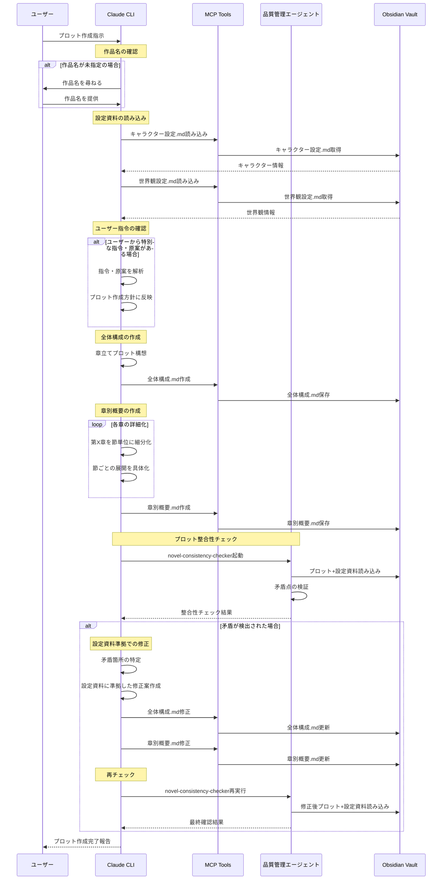

# プロット作成ガイドライン

## プロット作成フロー

## プロット作成の原則

### 1.0 プロットの基本構成原理：起承転結

1.1 定義
「起承転結」とは、物語の基本的な設計図（骨組み）であり、説得力のあるドラマを構築するための普遍的な定石である。
1.2 構成要素と機能

* 起 - 導入部
  * 機能: 物語の基本設定（登場人物、場所、時代）を提示し、物語のジャンルやトーン（例：喜劇、悲劇）を観客に明示する。
  * 欠陥時の問題: この段階での情報提供が不十分な場合、観客は物語世界に没入できず、理解が困難になる。
* 承 - 展開部
  * 機能: 物語の中核部分であり、全体の80-90%を占める。導入部で提示された状況を発展させ、複数の事件や葛藤を導入し、物語を前進させる。
  * 欠陥時の問題: この部分の魅力が欠如していると、物語全体が単調で面白くないものになる。
* 転 - クライマックス部
  * 機能: 物語の最高潮であり転換点。作者のテーマが最も強く表現され、観客に最大の感動を与えるべき部分。
  * 欠陥時の問題: この部分が弱い、または存在しない場合、物語の核心が不明瞭になり、強いインパクトを与えられない。
* 結 - 結末部
  * 機能: 物語の収束部分。テーマを観客の記憶に定着させ、物語の余韻を残す。
  * 欠陥時の問題: 結末が不適切な場合、観客は満足感を得られず、作品全体の評価が低下する。

### 2.0 プロット作成の実践的プロセス

2.1 設計思想
物語を時系列順に書き進めるのではなく、最終的な目標から逆算する戦略的思考で構成する。
2.2 具体的な手順

1. 手順1: クライマックス（転）から定義する
   * アクション: 物語の頂点であるクライマックスを最初に設定する。ここで達成したい感情的効果と、物語の核心となるテーマを明確に定義する。
2. 手順2: 導入部（起）にアンチテーゼを設定する
   * アクション: テーマとは正反対の状況や価値観（アンチテーゼ）を物語の開始点として設定する。これにより、物語に内在的な対立と葛藤（ストラグル）が生まれ、ドラマが駆動する。
   * 例: テーマが「友情の尊さ」であれば、導入部では主人公が「友情は無価値だ」と信じている状況から始める。
3. 手順3: 「箱書（はこがき）」を用いて全体を設計する
   * 定義: 「箱書」とは、各シーンの要約を箇条書きにし、それらを視覚的に配置して物語全体の流れを設計する手法である。
   * 目的: 物語の論理的整合性、ペース配分、時間の経過などを客観的に管理・調整する。

### 3.0 プロットを強化する高度な技術

3.1 構造的技術

* 表と裏の問題
  * 定義: 観客が直接見ている画面（表）で進行する出来事と、その裏で同時に発生している他の出来事（裏）を意識的に選択し、配置する技術。
  * 効果: より効果的で面白いシーンを選択することで、物語に奥行きと多層性を与える。

3.2 動的技術

* リトマス法
  * 定義: 物語を能動的に展開させるための核心技術。特定の状況に対し、外部から刺激となる要素（別の人物、事件、情報、小道具など）を投入する。
  * 効果: 登場人物の反応（リアクション）を引き出し、その人物の心理、性格、感情を間接的に描写し、物語を前進させる。

3.3 表現的技術

* 伏線
  * 定義: 後の展開に論理的説得力を持たせるため、事前に情報を提示しておく技術。
  * 目的: ご都合主義的な展開を排除し、物語の完成度を高める。
* シャレード
  * 定義: セリフに依存せず、人物の行動、仕草、小道具との関わり方を通じて、その心理状態、人間関係、置かれた状況を暗示する映像的な表現技術。
  * 効果: プロットに深みを与え、観客の解釈を促す。
